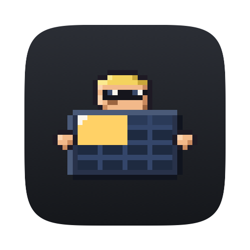
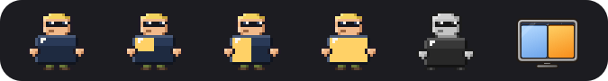
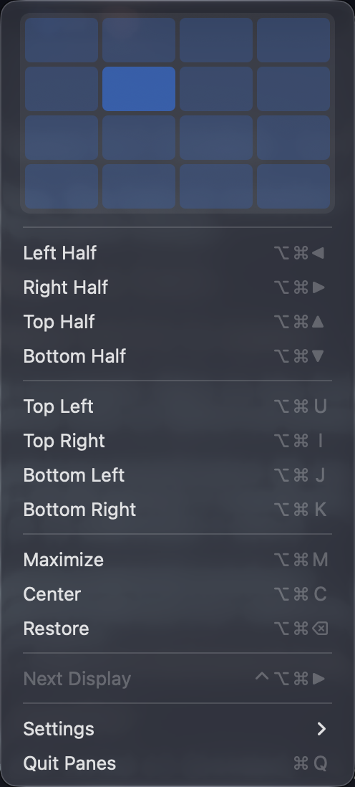
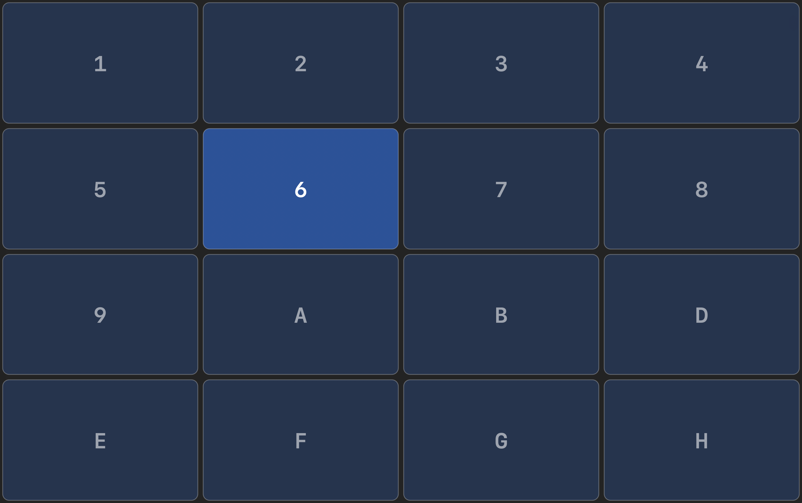
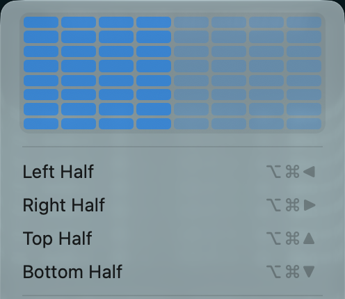
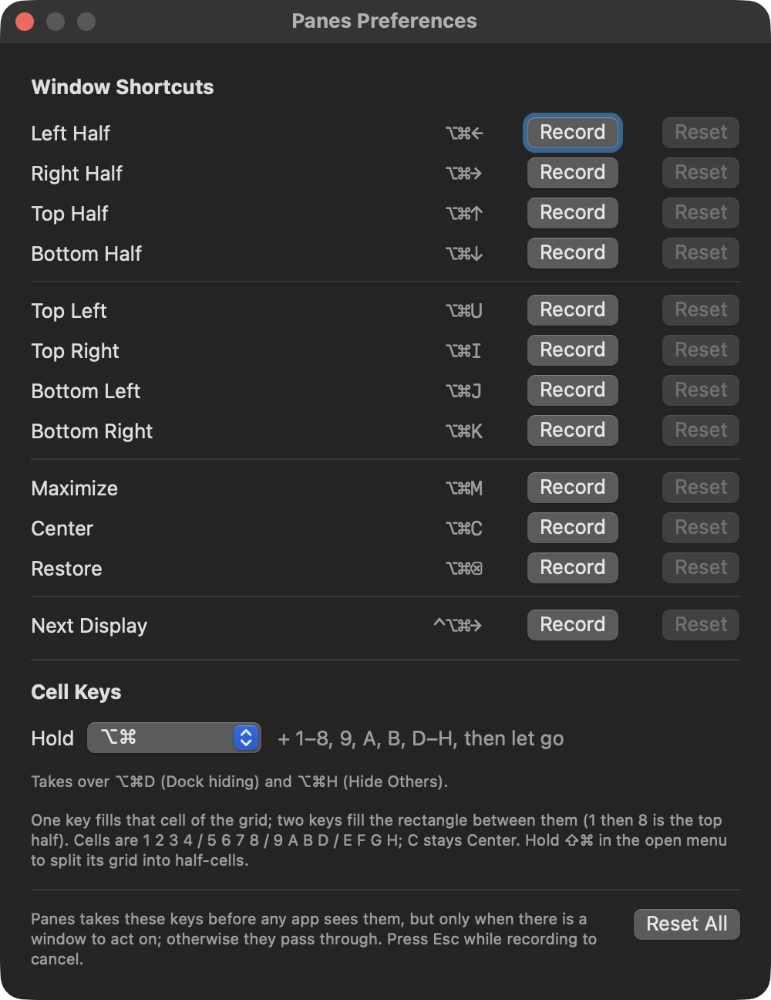

# Panes

<p align="center"></p>

<p align="center"></p>

A standalone macOS menu-bar app that arranges windows: **global shortcuts**
for halves, quarters, maximize, center, restore and next display; a **4×4
layout grid** in the menu, and over the whole screen while you hold `⌥⌘`; and
**edge snapping** when you drag a window to a display edge. A replacement for
Rectangle.

Its shortcuts are taken by a `CGEventTap` before any app sees them, so an
app that claims the same keys (iTerm2 and ⌥⌘M, say) cannot get in the way,
which is what goes wrong when window shortcuts are set in System Settings.

Built on [StatusItemKit](https://github.com/nicholaspsmith/StatusItemKit) (the
menu-bar shell) and [HotkeyKit](https://github.com/nicholaspsmith/HotkeyKit)
(the global key-tap engine). Part of
[Menumon](https://menumon.nicksmith.software).

**Version 0.8.1** · [Changelog](https://github.com/nicholaspsmith/panes-menubar/releases)

<p align="center"></p>

## Requirements

- macOS 13+ (tested on Apple Silicon, macOS 27)
- Accessibility permission (to move windows and intercept keys)
- Sibling checkouts of `StatusItemKit` and `HotkeyKit` next to this repo (to build)

## What it does

| Shortcut (default) | Action |
|--------------------|--------|
| `⌥⌘←` / `⌥⌘→` | left / right half; from a top or bottom half or quarter, the quarter on that side (see below) |
| `⌥⌘↑` / `⌥⌘↓` | top / bottom half; from a left or right half or quarter, the quarter at that end |
| `⌥⌘[` / `⌥⌘]` | top-left / top-right quarter |
| `⌥⌘;` / `⌥⌘'` | bottom-left / bottom-right quarter |
| `⌥⌘M` | maximize (the visible frame: below the menu bar, beside the Dock) |
| `⌥⌘C` | center at the screen's proportions; press again to step the size up, then down (see below) |
| `⌥⌘⌫` | restore: undo the last move Panes made to this window (again for the one before) |
| `⌥⌘N` | move to the next display, keeping the window's relative frame |
| `⌥⌘` + cell keys | fill one grid cell, or the rectangle between two, when you let go of `⌥⌘` (see below) |
| hold `⌥⌘` | a 4×4 grid over the screen: click or drag across cells (see below) |
| hold `⌥⌘⇧` | the same grid in half-cells, 8×8 |

Each acts on the focused window of the frontmost app. A shortcut is
swallowed only when it applies: with no movable window in front, nothing to
restore, or a single display for Next Display, the key passes through to the
app. Rebind any of them in **Settings ▸ Preferences…** (Esc cancels a
recording; a shortcut shared by two actions is flagged in red).

### Center, then grow

`⌥⌘C` centres the window, horizontally and vertically, at the screen's own
proportions. Its sizes are 50%, 66%, 80% and 100% of the visible frame's width
and height. The first press picks the size closest to the window's current
one; each further press (while the window is still where the last `⌥⌘C` put
it) steps one size up until it fills the screen, then back down to 50%, then
up again, for as long as you keep pressing. Move the window in between (by
hand or with another Panes action) and the next press starts over.

### Arrows combine

The arrows work like Windows 11's Win + arrows: Panes reads which half or
quarter the window is in now, and each arrow moves one edge. `⌥⌘←` then `⌥⌘↑`
is the top-left quarter; from there `⌥⌘→` is top-right and `⌥⌘↓`
bottom-right. A window that isn't in a half or quarter gets a half: `⌥⌘←`
the left half, `⌥⌘↑` the top half. Pressing toward the side the window is already
on widens it back to that half: `⌥⌘→` on the top-right quarter is the right
half, `⌥⌘↑` on it the top half.

### Cell keys

The grid's 16 cells have keys, row by row from the top-left (no `C`, which
stays Center):

```
1 2 3 4
5 6 7 8
9 A B D
E F G H
```

Hold `⌥⌘`, press a cell's key and let go: the front window fills that cell.
Press two keys before letting go and it fills the rectangle spanning both, in
either order (`1` then `8` is the top half, `1` then `H` maximizes); with more
than two, the first and last count. A translucent preview shows the target
while `⌥⌘` is held. A chord only starts on a cell key, so `⌥⌘` with an arrow,
`[` `]` `;` `'`, `M`, `C`, `N` or `⌫` still acts at once (and drops any chord
in progress), as does any shortcut you rebind onto a cell key. Cell keys are
taken only while a window is in front to arrange.

**Panes takes over `⌥⌘D`** (macOS: hide or show the Dock) **and `⌥⌘H`**
(Hide Others) whenever a window is in front. Preferences can move cell keys to
`⌃⌥`, `⌃⌥⌘` or `⇧⌘` (the last takes over the screenshot shortcuts `⇧⌘3`,
`⇧⌘4` and `⇧⌘5`).

### Grid on hold ⌥⌘

Hold `⌥⌘` on its own (no other key, no mouse button) for a moment (0.35 s by
default) and a dark grid fades in over the front window's display. It covers
exactly the display's visible frame, below the menu bar and beside the Dock,
so each cell sits over the very area a window filling it would take. The same
4×4 grid as the menu, with the same cell labels and shading: click a cell, or
drag across cells, and the front window fills it. The app you were in keeps
focus throughout.

- Let go of `⌥` or `⌘` and it fades out (a drag in progress is dropped).
- Press any key while it is up, a cell key or a shortcut included, and it
  goes at once; the key does what it always does. Panes never takes `Esc`,
  so `⌥⌘Esc` is still Force Quit.
- A quick `⌥⌘` shortcut or a cell-key chord never brings it up: any key
  during the hold cancels it until `⌥⌘` is let go.
- Hold `⌥⌘⇧` (from the start, or add `⇧` while it is up) for half-cells;
  drop `⇧` for 4×4 again.

Turn it off in **Settings ▸ Grid on Hold ⌥⌘**; set the delay in Preferences.



### Half-cells

Hold `⌥⌘⇧` while the menu is open (or on the hold-⌥⌘ grid) and every cell
splits into its own 2×2, an 8×8 grid of half-cells. Click one, or drag across
several, to fill that area exactly as with the 4×4 grid; shading follows the
finer cells. Let go of `⇧` to return to 4×4 (cell-key labels show only there).
`⌥⌘⇧` on its own is never taken from apps and never starts a chord.



<p align="center"></p>

### The menu

(Pictured at the top of this page.)

- **The layout grid**: the display the front window is on, cut into 4×4
  cells at its visible frame's aspect ratio, each labelled with its
  [cell key](#cell-keys) (hold `⌥⌘⇧` for [half-cells](#half-cells)). Click a cell and the window fills
  it; drag across cells and the selection highlights as you go, and the
  window fills it on release (a 2×4 drag from the top-left is the left half).
  Cells under the front window are shaded in the accent colour, cells under
  other windows on that display lightly. The menu closes once the window is
  told where to go.
- **The actions**, each showing its shortcut; clicking one applies it to the
  window that was in front when the menu opened. Greyed when they do not
  apply.
- **⚠ Grant Accessibility…**: shown only until Panes is trusted.
- **No window to arrange**: shown, greyed, when no movable window is in front.
- **⚠ macOS Edge Tiling Is On…**: shown when Edge Snapping is on and so is
  macOS's own tiling (`com.apple.WindowManager` `EnableTilingByEdgeDrag` /
  `EnableTopTilingByEdgeDrag`; unset means on). Opens Desktop & Dock.
- **Settings ▸** (StatusItemKit's `SettingsMenu`)
  - **Edge Snapping**: on by default.
  - **Grid on Hold ⌥⌘**: on by default; see [below](#grid-on-hold-).
  - **Preferences…** (⌘,): rebind the shortcuts.
  - **Start at Login**, then the version.
- **Quit Panes** (⌘Q).

### Edge snapping

Drag a window by its title bar to a display edge: left or right for that
half, the top to maximize, within 40 pt of a corner for that quarter (the
bottom edge snaps only at its corners). A translucent preview shows the
target while the cursor is there; release to snap, or move away to cancel.
An edge another display sits against is not an edge, so dragging a window
across to the next display never snaps on the way.

### Animation

Every move (shortcut, grid, snap, restore) glides there: an ease-out over
0.18 s, a little quicker than macOS's own tiling, stepping at 120 Hz. It is
time-driven, so an app slow to apply Accessibility sets gets fewer, larger
steps rather than a late stutter, and one too slow for four steps jumps
straight there. Reduce Motion jumps every time. Each move ends with an exact
size, position, size, then a re-read: a window that refuses the size (a
minimum width, a terminal snapping to cells) is nudged back against the edges
its target hugged, so a too-wide right half stays flush right.

## Major Pane

Panes's mascot is **Major Pane**, a commander of windows: blond flat-top,
square jaw, dark shades, chest out, holding his pane in front of him like a
riot shield, a fist round each edge. He is pixel art, hand-placed on a 22×22
grid with twenty colours, drawn in whole pixels at the bar's backing scale so
nothing is ever blurred. The pane is a 4×4 window grid, and its cells light to
show where the frontmost app's window sits: eight for a half, four for a
quarter, all sixteen when it is maximized, none when it floats free, when there
is no window, or when that window is on another display.

He stands at attention (a slow breath, a glint on the shades) and, in Panes's
turn in the Menumon minute cue, snaps a salute. When Panes moves a window he
barks the order and the pane relights to its new tile. Without Accessibility
he stands at ease, pane lowered, greyed out. Under Reduce Motion he holds
still. **Settings ▸ Icon** swaps him for the screen-grid glyph below.

**The screen grid**, the alternate icon, is a little display in the Menumon
glyph style (shaded bezel on a stand, dark glass, ink outlines), shaped like
the display the icon sits on, with a faint 4×4 grid. Every window on that display is drawn on it as a small tile at its
true scaled position and size, whether or not it fits the grid, back to front
with outlines so overlaps read; the frontmost window is amber, the others
soft blues, greens and lilacs. It greys out, like
Major Pane, while Accessibility is not granted.

The window list comes from `CGWindowListCopyWindowInfo` (bounds only, which
needs neither Accessibility nor Screen Recording). The icon redraws when an
app activates, the Space or the displays change, after Panes moves a window,
and on a 1.5 s poll that redraws only when the bounds list has changed.

<p align="center"></p>

When the grid is the chosen icon it takes Panes's turn in the Menumon minute
cue (StatusItemKit's `MinuteCue`) instead of the salute: twice a minute the
windows on the display bunch up in the middle and slide out into their tiles,
the front one glowing as it lands. Not under Reduce Motion, and not on an
empty display. The app icon is Major Pane drawn large on the dark tile every
Menumon app shares.

## How it works

- **HotkeyKit** owns the key tap. Arrow keys (and Home/End, Page Up/Down,
  Forward Delete) always carry the fn flag, and HotkeyKit matches modifiers
  exactly, so each binding on one of those keys is registered twice, with and
  without fn. While Preferences records a shortcut, the tap lets keys through
  to the recorder. The tap is re-created every 6 s to stay ahead of taps other
  apps add later.
- **Cell keys** need a second tap of Panes's own (`ChordTap`): a chord ends
  when the modifiers are *released*, and HotkeyKit's tap never sees
  `flagsChanged`. The same tap feeds the hold-⌥⌘ grid (`HoldGrid` in
  PanesCore decides when it shows and goes; the grid view is shared with the
  menu). It swallows only cell-key presses (and their key-ups) made
  with exactly the chord modifiers; `ChordLogic` in PanesCore decides.
- **Accessibility** (`AXUIElement`) reads and sets the focused window's
  position and size (messaging timeout 0.3 s, so a hung app cannot stall the
  tap). Only standard windows and dialogs whose position is settable, not
  minimized and not full screen, are moved. `AXEnhancedUserInterface` is
  switched off on the app during a move and put back (it makes Chromium and
  Electron apps animate every set). Restore history is keyed by the window's
  `CGWindowID` (`_AXUIElementGetWindow`).
- **Coordinates**: all frame math happens in AX space (origin at the top-left
  of the primary display, y down, so a display left of the primary has negative
  x and one above it negative y). `NSScreen` frames and the cursor are flipped
  in once with the primary display's height.
- **Edge snapping** uses global mouse monitors (no permission needed for mouse
  events). A press on a window becomes a snap drag once that window has moved
  without changing size, which tells a title-bar drag from a resize or a drag
  inside the content.
- **PanesCore** holds the testable logic: frames for every action on any
  display layout, center-and-grow steps, cell-key chords, the relative move between displays, the fit-after-refusal
  nudge, snap zones, restore history, the grid, the frame interpolation and
  pacing, the icon's window mapping and pixel alignment, bindings and their
  formatting. **PanesGlyph** draws the icon, shared by the app and
  `panes-render-icons`.

## Install

```sh
./install.sh
```

Builds `Panes.app`, symlinks it into `~/Applications`, and launches it. Grant
**Accessibility** when prompted.

### Make the Accessibility grant survive rebuilds (recommended)

An ad-hoc signed build gets a new code hash on every rebuild, and macOS drops
the Accessibility grant. Create a stable local signing identity **once**; the
build script uses it whenever it exists:

```sh
../StatusItemKit/scripts/setup-signing.sh   # one-time, idempotent
./install.sh                                # rebuild signs with it
```

**If the shortcuts stop working after a rebuild**, the grant went stale:
re-approve Panes in System Settings ▸ Privacy & Security ▸ Accessibility. If it
is already on but inert, clear the stale entry and re-grant:

```sh
tccutil reset Accessibility com.nicholaspsmith.Panes
open ~/Applications/Panes.app
```

### Start at Login (optional)

Toggle it from **Settings ▸ Start at Login** in the menu, or from the shell:

```sh
"$HOME/Applications/Panes.app/Contents/MacOS/Panes" --login on       # or: off, status
```

### Coming from Rectangle

Quit Rectangle (and remove it from Login Items) before relying on Panes: both
would take the same keys and both would snap at the edges. Clear any window
shortcuts set in System Settings ▸ Keyboard ▸ Keyboard Shortcuts ▸ App
Shortcuts too, and turn off macOS's own edge tiling in Desktop & Dock (the
menu warns while it is on).

## Develop

```sh
swift build                    # compile
swift test                     # PanesCore unit tests
scripts/make-icon.sh           # Resources/bundle/AppIcon.icns and docs/mascot.png
python3 art/major-pane/build_frames.py && python3 art/major-pane/render.py   # the art → frames.json, review renders in art/major-pane/out/
scripts/gen_major_pane_frames.py art/major-pane/frames.json                 # → Sources/PanesGlyph/MajorPaneFrames.swift (a test fails if stale)
swift run major-pane-render preview out.html [--frames FILE]                 # every clip animating, the review page
```

Major Pane is drawn in `art/major-pane/build_frames.py`, every pixel in code;
`render.py` makes contact sheets and an animated sheet to check it, and the
generator compiles it into Swift. The concept sketches in `art/mascot/` are
guide only.

Every Menumon app's pictures are rendered from its own drawing code by the
[Menumon site](https://github.com/nicholaspsmith/widgets.nicksmith.software)'s
`art/glyphs`, which compiles `PanesGlyph` with the PanesCore types it needs.
`scripts/make-icon.sh` runs its `app-icons.sh` for Panes alone (needs that repo
and StatusItemKit checked out beside this one); its `render-glyphs.sh` draws
`docs/menubar-icon.png` along with every other app's strip.

## Releasing

Every push to `main` is a release. Before pushing, add a dated
`## [X.Y.Z] - YYYY-MM-DD` section to the top of [`CHANGELOG.md`](CHANGELOG.md)
(minor for features, patch for fixes; turn a waiting `## [Unreleased]` into
it). When it reaches `main`, GitHub tags `vX.Y.Z` and publishes the section as
a release titled `vX.Y.Z`. Without a new version:

- a push is refused locally by the `pre-push` hook;
- a pull request **cannot merge** — `release / check` is required on `main`;
- a push that reaches `main` anyway fails the release workflow.

The one exception is `[no release]` in the tip commit's message, for changes
nothing a user runs (setup, CI, developer docs): it passes every check with no
version bump and no tag. Never tag or create a release by hand, and never
`gh pr merge --admin` past a failing check — fix the PR. After merging,
`git pull` for the tag, rebuild (the menu's version row is stamped from it),
and update the version line at the top of this README. `install.sh` re-arms
the hook on a fresh clone. See
[StatusItemKit — Releases](https://github.com/nicholaspsmith/StatusItemKit#releases-every-push-is-one)
for the whole rule.

## The menu-bar suite

A suite of macOS menu-bar apps that share one framework, one build-and-sign
script and one installer, built to sit in the same bar: consistent menus, a
common **Icon** picker, and cooperative hiding so no icon strands another.

| App | What it does |
|---|---|
| [Claude Usage](https://github.com/nicholaspsmith/claude-usage-menubar) | Claude Code plan limits, resets, and live agent sessions |
| [Apollo Monitor](https://github.com/nicholaspsmith/apollo-monitor-menubar) | Apollo audio-interface monitor level |
| [Battery Time](https://github.com/nicholaspsmith/battery-time-menubar) | Time remaining, power mode, and 24h usage |
| [VPN & DNS](https://github.com/nicholaspsmith/vpn-dns-menubar) | An iguana for Mullvad + Tailscale state, with a DNS watcher |
| [Mac Daddy](https://github.com/nicholaspsmith/mac-daddy-menubar) | Kills media trackers, trashes stale downloads, reaps hung processes, watches the UA mixer engine, and sweats as your process count climbs |
| [KeyLight](https://github.com/nicholaspsmith/keylight-menubar) | Ctrl+brightness keys remapped to keyboard backlight |
| [Monitor Lizard](https://github.com/nicholaspsmith/monitor-lizard-menubar) | External-monitor brightness, contrast and resolution, Night Shift, and the built-in screen from dimmer than macOS allows to XDR |
| [Homestead](https://github.com/nicholaspsmith/home-assistant-menubar) | Home Assistant dashboards and device controls in the menu |
| [SoundChain](https://github.com/nicholaspsmith/soundchain-menubar) | One chain of Audio Unit effects over all system audio |
| [Menu Crane](https://github.com/nicholaspsmith/menu-crane) | A ⌘Space launcher for apps, arithmetic, unit conversions and emoji |
| **Panes** | Window shortcuts, a layout grid and edge snapping |
| [MacRecorder](https://github.com/nicholaspsmith/MacRecorder) | Screen recording with system audio |
| [Barn](https://github.com/nicholaspsmith/menubar-barn) | macOS 26 and earlier only: hides a block of status icons by width (on macOS 27, use System Settings ▸ Menu Bar) |

| Framework | |
|---|---|
| [StatusItemKit](https://github.com/nicholaspsmith/StatusItemKit) | Status-item lifecycle, polling, menus, meter and mascot icons, the shared Icon picker |
| [HotkeyKit](https://github.com/nicholaspsmith/HotkeyKit) | CGEventTap engine for intercepting and remapping global keys |

Install the whole suite on a fresh Mac with
[macOS Dev Environment Setup](https://github.com/nicholaspsmith/MacOS-Dev-Environment-Setup):

```bash
git clone https://github.com/nicholaspsmith/MacOS-Dev-Environment-Setup.git
cd MacOS-Dev-Environment-Setup && ./bootstrap.sh --all
```

## License

Copyright (c) 2026 Nicholas Smith. Licensed under the
[Mozilla Public License 2.0](LICENSE). You may use, modify, sell and
redistribute this software, including inside proprietary products, provided
the copyright notice and license stay on these files and any modified
versions of them are made available under the same license.

The Major Pane artwork (`art/`, the generated frames, the icon and the
pictures in `docs/`) is [CC BY-NC 4.0](art/LICENSE): see [NOTICE](NOTICE). It
may not be used commercially.
